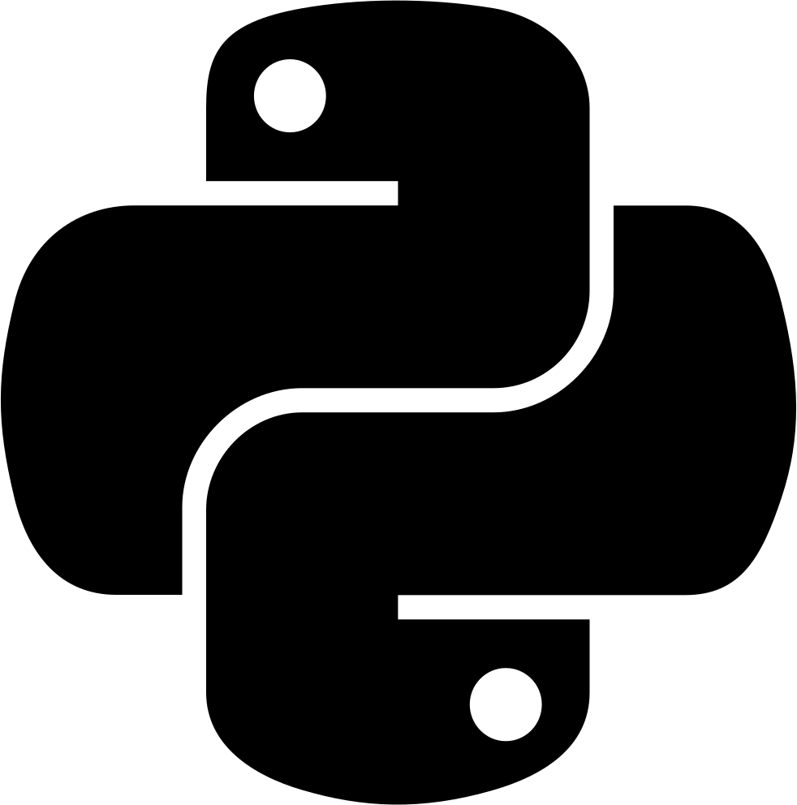

<h1 align="center">Programación en Python</h1>

Practicas y tareas de la materia Programacion en Python

<h3>Enlaces de Tareas</h3>

 <b>Primer Parcial</b>   
- [Ambiente Virtual Python](https://drive.google.com/open?id=1bTmvgCMVrxyAJB2Us5iCsKWob4-Tir6A)
- [Tipos de Datos](https://drive.google.com/open?id=1iNdxHFm8dS-ilK-PadzvpW0R4_lBzinw)
- [Estructuras de Control e Iteración](https://drive.google.com/open?id=1AvAEwKSBe1vACzmHaJaSKMZCw8sxzBjg)
- [Try Except](https://drive.google.com/open?id=1u1jTohBZ8XmVvscK-Pva65x_YEvci9Sl)
- [Programación Orientada a Objetos en Python](https://drive.google.com/open?id=1soK3WJkzCkgZ_AFHImfbyCr2Zg96xchG)

<b>Segundo Parcial</b>   
- [Instalación de Django y Creación de Proyecto](https://drive.google.com/file/d/1KuYnKsHkOGSArP8z9ElwabJl8rSQW3b6/view)
- [Creación de App y Configuración](https://drive.google.com/file/d/1fmL-JIGcgK3V_KzKXtjVQ898jBeKiw8b/view)
